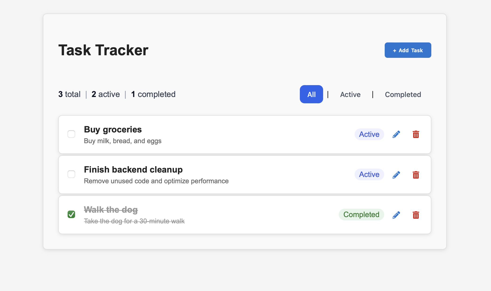

# Task Tracker (Full Stack)

A simple full-stack task tracking application built with:

- **Backend:** ASP.NET Core (.NET, C#)
- **Frontend:** React (Vite)
- **Database:** SQLite (via Entity Framework Core)
- **Architecture:** REST API + client-side UI

## Features

- Create tasks
- View all tasks
- Filter tasks by completion status
- Update task title, description, and completion state
- Delete tasks
- Persistent storage using SQLite

## Backend (ASP.NET Core)

- Minimal API structure
- Dependency Injection (scoped service layer)
- Entity Framework Core (SQLite)
- Database persistence with migrations
- Request models for create/update operations
- Input validation
- REST-style endpoints
- Swagger/OpenAPI for testing

### Endpoints

- `GET /tasks` – Get all tasks (optional filter by `isCompleted`)
- `GET /tasks/{id}` – Get task by ID
- `POST /tasks` – Create task
- `PUT /tasks/{id}` – Update task
- `DELETE /tasks/{id}` – Delete task

## Frontend (React)

- Fetches data from backend API
- Displays task list
- Handles loading and error states

## Project Structure
```text
Tasklist/
├── backend/        # ASP.NET Core API
│   ├── Data/
│   ├── Models/
│   ├── Services/
│   ├── Contracts/
│   └── Migrations/
│
└── frontend/       # React app (Vite)
```

## Running the project

### Backend

```bash
cd backend
dotnet restore
dotnet ef database update
dotnet run
```

### Frontend
```bash
cd frontend
npm install
npm run dev
```


## Notes
This project was built as part of learning and practicing:
 - C# and .NET Web API development
 - React fundamentals
 - Full-stack integration
 - Git and project structuring
 - Working with relational databases using EF Core
 - Structuring backend services and API layers
 
## Future improvements
- Add due dates and task priorities
- Improve UI/UX 
- Add authentication
- Convert frontend to TypeScript

## Preview

